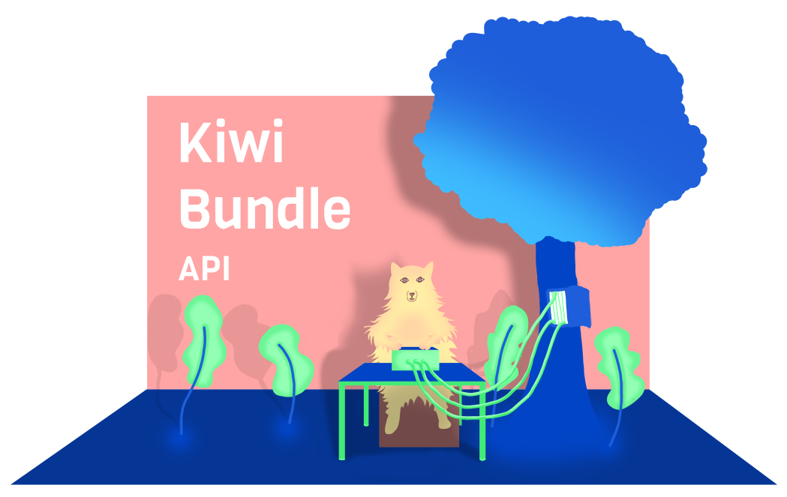

## Getting Started

**./package.json** (required)
```json
{
  "name": "example",
  "version": "1.0.0",
  "scripts": {
    "start": "kiwi start",
    "test": "kiwi test",
    "build": "kiwi build"
  },
  "bundles": {
    "kiwi-bundle": {
      "options": {
        "dev": {
          "webHost": "0.0.0.0",
          "webPort": 8040
        }
      },
      "handlers": {
        "/": "./handlers/root"
      }
    }
  },
  "dependencies": {
    "kiwi-bundle-api-runtime": "1.0.0"
  },
  "devDependencies": {
    "kiwi-bundle": "3.1.0",
    "kiwi-bundle-api": "1.1.0"
  }
}
```

**./tsconfig.json** (required)
```json
{
  "extends": "./node_modules/kiwi-bundle/.models/ts/commonjs.json",
  "compilerOptions": {
    "rootDir": "src",
    "outDir": "dist"
  },
  "include": [
    "./src/**/*"
  ],
  "exclude": [
    "node_modules",
    "src/**/*.test.ts",
    "src/**/*.test.tsx"
  ]
}
```

**./src/handlers/root.ts** (example)
```typescript
import { Handler } from "kiwi-bundle-api-runtime"
export default Handler(context => ({
  GET: Promise.resolve("Hello :)")
}))
```

**./.gitignore** (recommended)
```
dist/
node_modules/
```

**./tslint.json** (optional)
```json
{
  "extends": "./node_modules/kiwi-bundle/.models/tslint/bf.json"
}
```
